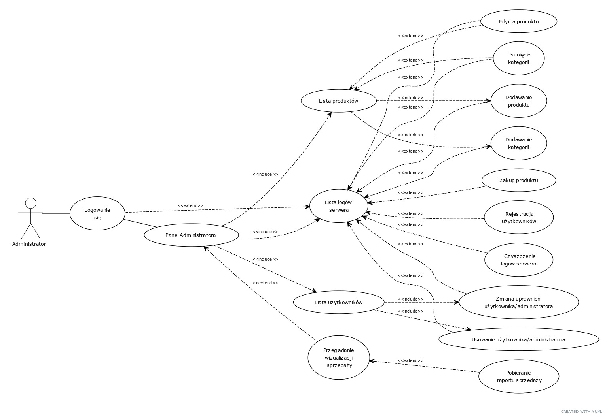
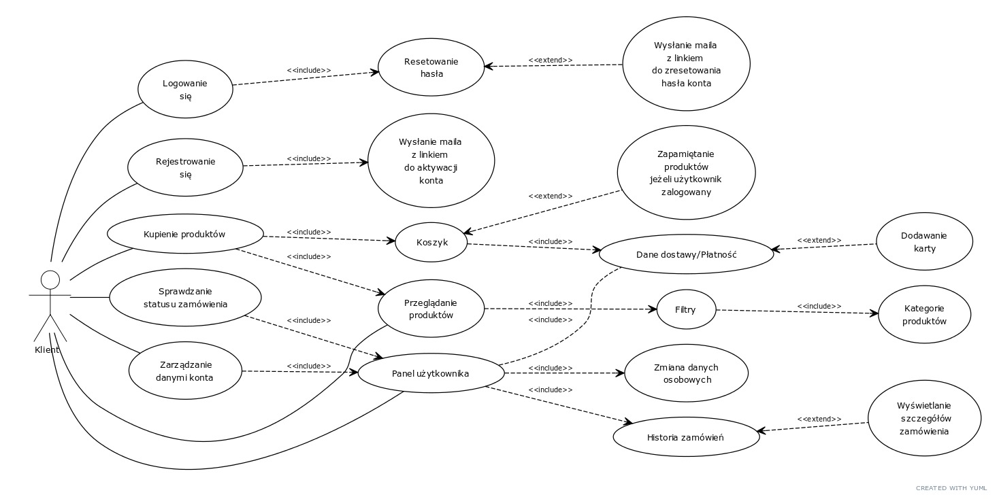

# README

## E-commerce Application Project with Django, Azure, and Online Payment Integration

### Table of Contents
1. [Introduction](#introduction)
2. [Technologies Used](#technologies-used)
   - [Backend - Django](#backend---django)
   - [Frontend - Django Views + Bootstrap](#frontend---django-views--bootstrap)
   - [Hosting - Azure App Service](#hosting---azure-app-service)
   - [Data Storage - Azure Database for PostgreSQL](#data-storage---azure-database-for-postgresql)
   - [Version Control - GitHub](#version-control---github)
3. [Key Features and Components](#key-features-and-components)
4. [Acceptance Criteria](#acceptance-criteria)
5. [MoSCoW Analysis](#moscow-analysis)
6. [Component Diagrams](#component-diagrams)
7. [Use Cases](#use-cases)
8. [User Stories](#user-stories)
9. [Application Wireframes](#application-wireframes)

---

### Introduction

This project is a complete e-commerce application built using the Django framework, integrated with Azure services for hosting and data storage, and equipped with online payment systems. The goal is to create a functional and secure online store that meets all functional requirements outlined in the project guidelines.

---

### Technologies Used

#### Backend - Django

The application backend is built with Django, a powerful framework that enables efficient and secure management of core functionalities such as user authorization, session handling, and database operations. Key features include:

- User registration and authentication
- Shopping cart and session management
- Database handling for user, product, and order data
- API integration for external services (e.g., payment systems)

#### Frontend - Django Views + Bootstrap

Django Views ensure seamless integration between backend logic and data display. Bootstrap is used for responsive design, optimizing the site for mobile and desktop users alike. Important elements include:

- Shopping cart interface
- User registration and login forms
- Checkout and payment process screens

#### Hosting - Azure App Service

The application is hosted on Azure App Service, providing scalability, reliability, and ease of deployment. Key benefits:

- High availability for order processing, payments, and product management
- Automated scaling and version updates to handle varying traffic loads

#### Data Storage - Azure Database for PostgreSQL

Data management is handled by Azure Database for PostgreSQL, ensuring secure and scalable storage of user, product, and order information. Benefits include:

- High-performance data access
- Automatic backups for data security
- Scalability for user and product growth

#### Version Control - GitHub

GitHub is used for version control, team collaboration, and feature management. Key functionalities include:

- Tracking code changes and managing contributions
- Structured deployment and version management
- Safe and organized development of critical features like shopping cart, payments, and security

---

### Key Features and Components

| Id | Feature                     | Description                                                                                   |
|----|------------------------------|-----------------------------------------------------------------------------------------------|
| 1  | Shopping Cart                | Add, remove, and update products in the cart with session management to retain items.         |
| 2  | Order Process and Shipping   | Complete order processing, including adding to cart, checkout, and selection of shipping.     |
| 3  | User Registration & Login    | Account creation, login, and password reset with email verification for added security.       |
| 4  | User Account Management      | Update account details, view order history, and manage billing addresses.                     |
| 5  | Admin Account                | Manage users, logs, and products, including adding, updating, and viewing purchase history.   |
| 6  | Payment Integration          | Secure online payments with PayPal and other platforms, integrated into the order process.    |
| 7  | Security                     | Multiple layers of protection against attacks, secure data transmission, and user validation. |
| 8  | Data Validation              | Frontend and backend data validation for correct and compliant data entry.                    |

---

### Acceptance Criteria

1. **Shopping Cart**  
   - Add, remove, and update item quantities.
   - Maintain cart contents between user sessions.
   - Correct handling of user sessions.

2. **Order Process and Shipping**  
   - Add items to cart and complete checkout.
   - Choose preferred shipping method and finalize purchase.

3. **User Registration & Login**  
   - User account creation, login, password reset.
   - Email verification for added security.

4. **User Account Management**  
   - Update account details (email, billing address).
   - View order and purchase history.

5. **Admin Account**  
   - Manage user permissions, view server logs.
   - Add/update products and review purchase history.

6. **Payment Integration**  
   - Online payments with PayPal, Przelewy24, and cards.
   - Full payment integration within the order process.

7. **Security**  
   - SQL Injection prevention and SECRET_KEY management.
   - CSRF protection, trusted origins, and session security.
   - HTTPS enforced, secure static/media file access.

8. **Data Validation**  
   - Ensure correct data entry in all forms.

---

### MoSCoW Analysis

| Category       | Feature                                                                         |
|----------------|---------------------------------------------------------------------------------|
| **Must have**  | User registration/login, shopping cart, order process, payments, security, data storage |
| **Should have**| Email verification, order tracking, product search, server logs                  |
| **Could have** | Integration with more payment platforms, push/email notifications, product ratings |
| **Won't have** | Advanced personalization, social media integration, mobile app                   |

---

### Component Diagrams

---
